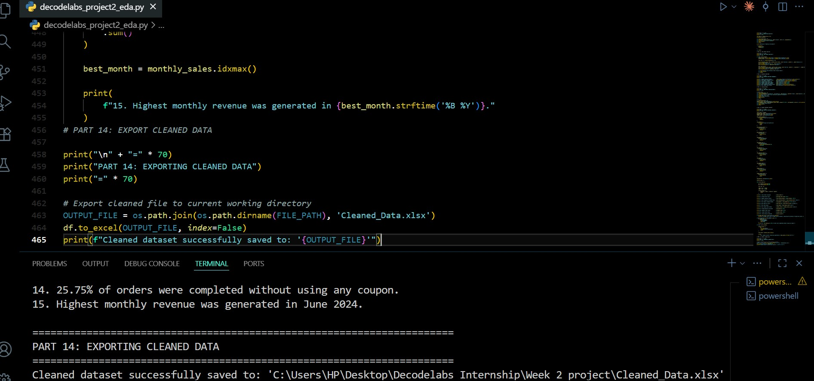
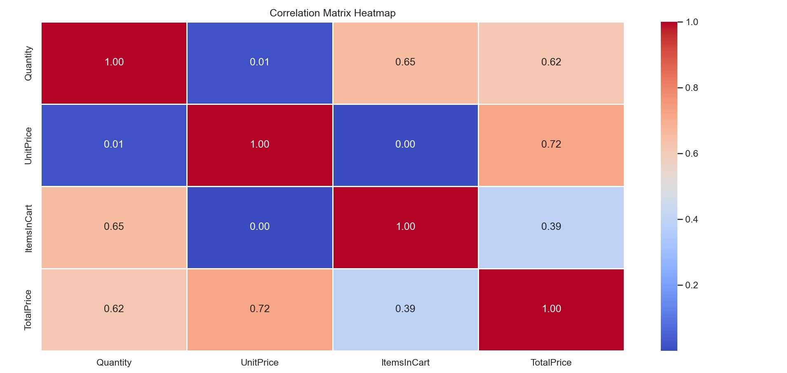
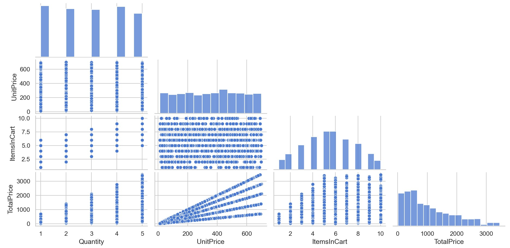
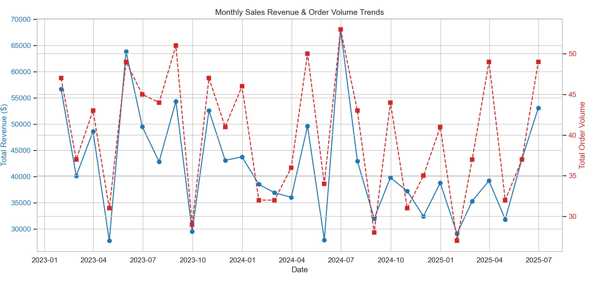
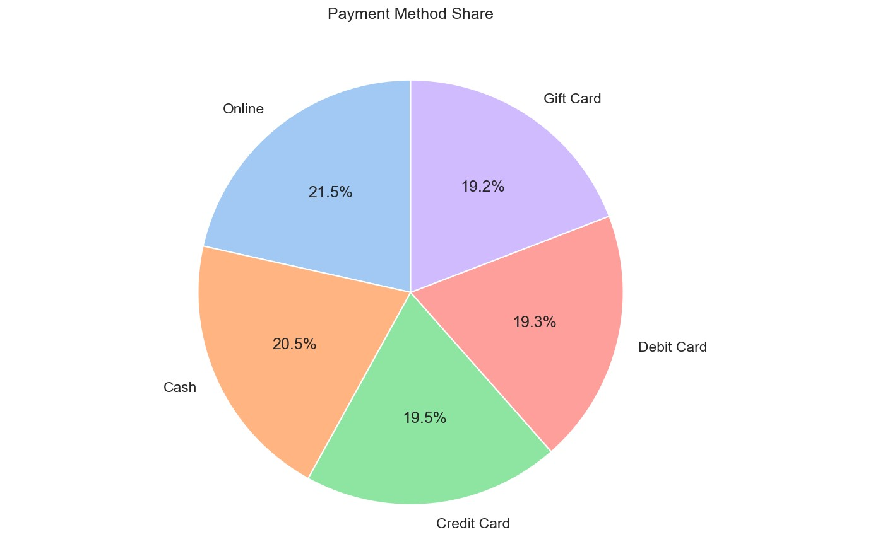
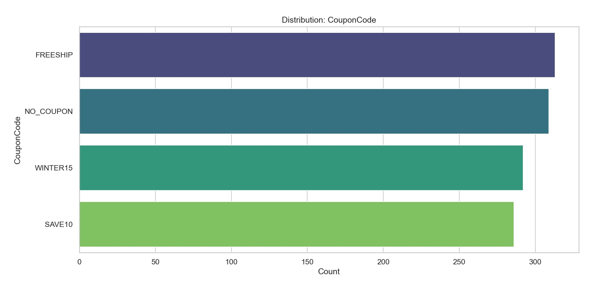
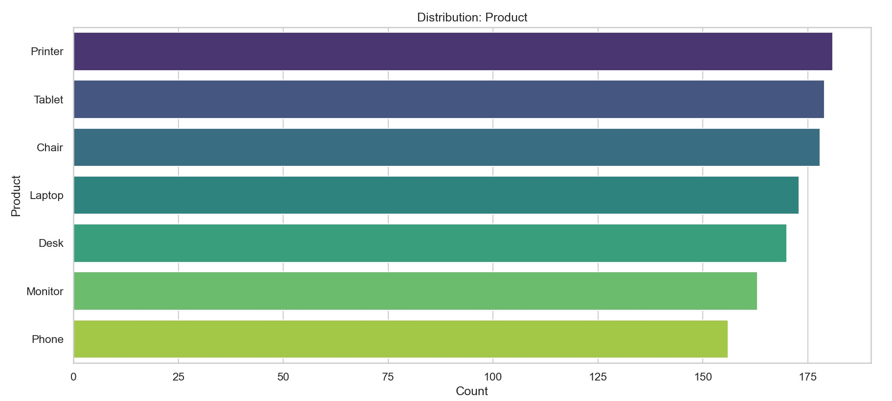
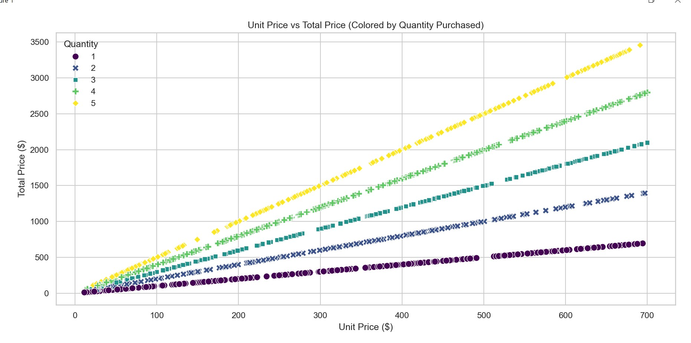

# 📊 Task 2 – Exploratory Data Analysis (EDA) using Python


## 📌 Project Overview

This project was completed as **Task 2** during the **DecodeLabs Data Analytics Internship**.

The objective of this task was to perform **Exploratory Data Analysis (EDA)** on an e-commerce sales dataset using **Python, Pandas, and Matplotlib** to uncover meaningful business insights through statistical analysis and data visualization.

The project demonstrates the complete workflow of importing data, understanding its structure, analyzing distributions, identifying relationships between variables, and presenting insights using professional visualizations.

---

# 🎯 Objectives

- Import and explore the dataset
- Understand data structure
- Perform Exploratory Data Analysis (EDA)
- Analyze numerical and categorical features
- Identify relationships between variables
- Generate business insights
- Create professional visualizations
- Prepare the dataset for future analytics

---

# 🛠 Technologies Used

- Python
- Pandas
- Matplotlib
- NumPy
- Jupyter Notebook / VS Code

---

# 📂 Repository Structure

```
Task-2-salarshah/
│
├── Dataset for Data Analytics P2.xlsx
├── Task-2-SalarShah.py
├── Data analytics Task2.pdf
├── README.md
│
└── screenshots/
    ├── python-analysis-code.jpg
    ├── correlation-heatmap.jpg
    ├── pairplot-numerical-features.jpg
    ├── monthly-sales_order-trends.jpg
    ├── Payment-Method-Distribution.jpg
    ├── coupon-code-distribution.jpg
    ├── product-distribution-analysis.jpg
    └── unit-price-vs-total-price.jpg
```

---

# 📈 Analysis Performed

## ✔ Data Exploration

- Imported the dataset
- Examined data structure
- Reviewed data types
- Generated descriptive statistics
- Checked dataset dimensions

---

## ✔ Exploratory Data Analysis

The project includes analysis of:

- Product Distribution
- Coupon Code Usage
- Payment Methods
- Monthly Sales Trends
- Numerical Feature Relationships
- Correlation Analysis
- Unit Price vs Total Price

---

# 📊 Project Visualizations

## 💻 Python Analysis Code



---

## 🔥 Correlation Heatmap

Shows the correlation between numerical variables to identify strong positive and negative relationships.



---

## 📉 Pairplot Analysis

Visualizes relationships between numerical features and their distributions.



---

## 📅 Monthly Sales Order Trends

Displays monthly sales activity to identify seasonal trends and customer purchasing behavior.



---

## 💳 Payment Method Distribution

Analyzes the frequency of different payment methods used by customers.



---

## 🎟 Coupon Code Distribution

Illustrates the popularity and usage of promotional coupon codes.



---

## 📦 Product Distribution Analysis

Highlights product purchasing patterns across the dataset.



---

## 💰 Unit Price vs Total Price

Shows the relationship between product pricing and total purchase amount.



---

# 📌 Key Business Insights

- Customer purchasing behavior was analyzed using sales trends.
- Product popularity was identified through distribution analysis.
- Payment preferences were explored.
- Promotional coupon usage patterns were evaluated.
- Feature correlations highlighted important numerical relationships.
- Pricing patterns revealed relationships between unit price and overall sales value.

---

# 🚀 Skills Demonstrated

- Exploratory Data Analysis (EDA)
- Python Programming
- Pandas
- Data Visualization
- Business Analytics
- Statistical Analysis
- Data Interpretation
- Data Cleaning
- Feature Analysis
- Correlation Analysis

---

# 📚 Learning Outcomes

This project strengthened my practical understanding of:

- Exploratory Data Analysis
- Business Intelligence
- Python for Data Analytics
- Statistical Thinking
- Data Visualization Best Practices
- Customer Behavior Analysis
- E-commerce Sales Analytics

---

# 💼 Internship

Completed as part of the **DecodeLabs Data Analytics Internship**, where real-world analytics tasks are performed using industry-standard tools and techniques.

---

# 👨‍💻 About Me

**Muhammad Salar Shah**

Financial Technology Student • Data Analytics Enthusiast • Python & Excel Analyst

### 🌐 Connect with Me

- 💼 LinkedIn: https://www.linkedin.com/in/salar-shah-7bb2683a2
- 💻 GitHub: https://github.com/salar13684-lgtm
- 🌍 Portfolio: https://finance-tech-portfolio.vercel.app/

---

# ⭐ If you found this project helpful

Consider giving this repository a **Star ⭐** to support my work and follow my data analytics journey.
